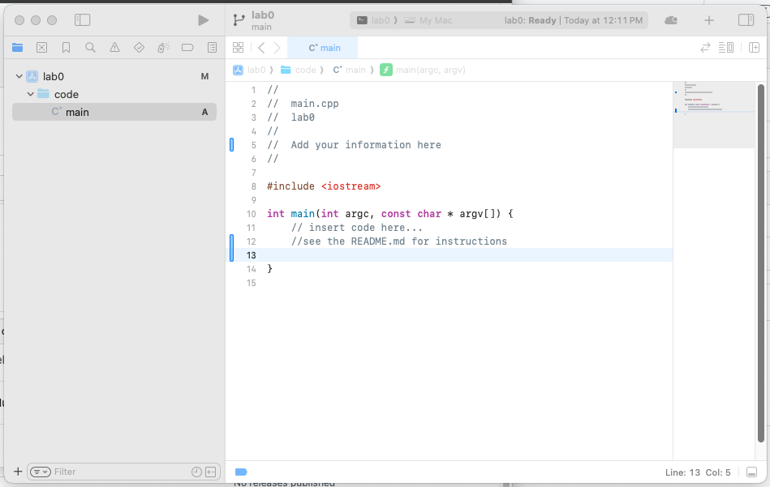

### CSCI 114 Lab 0
#### Setup

The purpose of this lab is to make sure you can use Xcode and Github desktop to do the labs and assignments for CSCI 114.

You can see this README.md on the Github website or you can view it locally. If you have not added your Github Classroom repo to your Github Desktop, let's do so now.

Open github.com and find the Github Classroom repo that was created when you accepted the invite. It should be something like this:

`https://github.com/usc-csci114/csci114-agoodney`

except `agoodney` will be replaced with your Github username.

Click the green "Code" button: and copy the **HTTPS** URL to the clip board.

Open Github Desktop and assuming you have not added any repositories before, choose 

Choose URL and paste the URL you copied above:

Carefully choose a "Local Path". This will be the location where all your work for the semester will be stored! Then click "Clone"

If it asks you about "How are you planning to use this fork?" Select "For my own purposes"

#### Task 1: Write a small C++ program

Open the folder where you saved your CSCI 114 repository and then open the lab0 folder. You should see an Xcode Project named "lab0". Open that project. You should see something like:

Modify the C++ code to do the following:

1. Print out the following: "Hi! Welcome to CSCI 114! What is your name?"
2. Create a variable of type **string** called name. ( You will need to add the proper `#include` line to make this work!)
3. Read in the users name.
4. Print out the message: "Ok great! What is your favorite number?" 
5. Create a variable of type **int**
6. Read in the users favorite number.
7. Print out the message "Great to meet you <name>! Your favorite number is <num>! That's awesome." (where <name> and <num> are replaced by the users name and favorite number).
8. Run your program inside Xcode. There is a minimal terminal inside xcode so you can type the input there.

#### Task 2: Run the program in a different terminal

Sometimes we want to run our programs from a different terminal. MacOS has a terminal installed (or you can download Ghostty from https://ghostty.org/).

1. Open a terminal and navigate using `cd` (or drag-and-drop) to the repository folder where your `lab0` lives. Then continue to navigate into the `DerivedData` folder until you get to the `Debug` folder. For me the final path looks something like: 
   `/Users/goodney/src/csci114-agoodney/labs/lab0/DerivedData/lab0/Build/Products/Debug`
2. Now run `./lab0`  and your program should run in this terminal.

#### Task 3: Upload your code using Github Desktop

Go back to Github desktop. All of your modified files should show under the "Changes" tab. Enter a summary in the "Summary" box. It should be short, like "Finished lab0". Click "Commit to main" then "Push Origin"

That's it, you've completed lab 0.